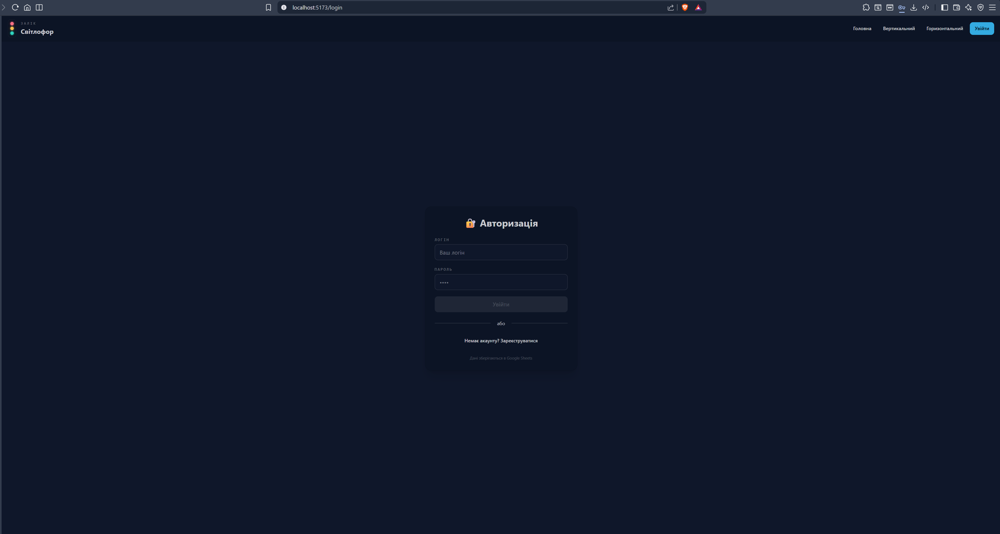
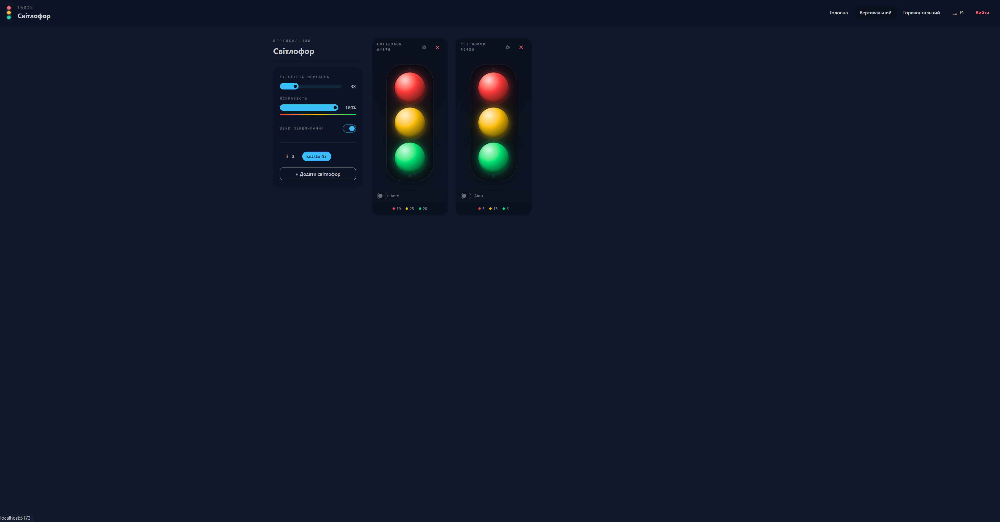
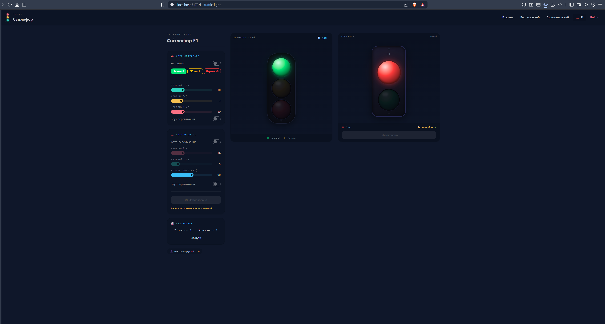
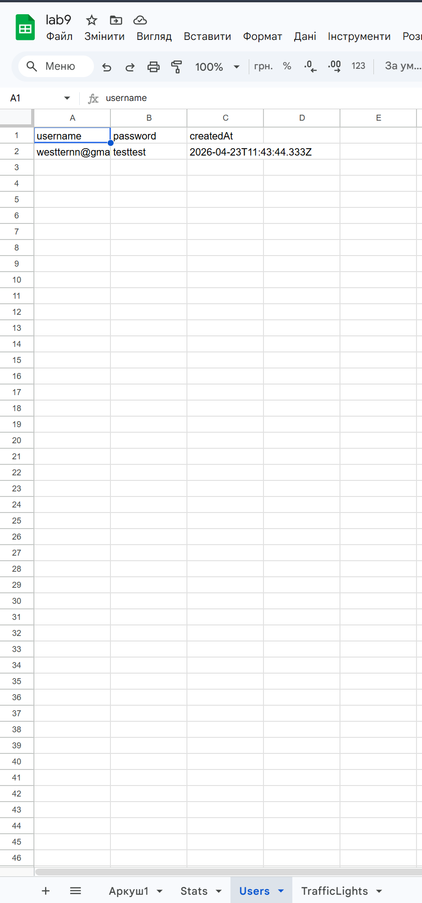
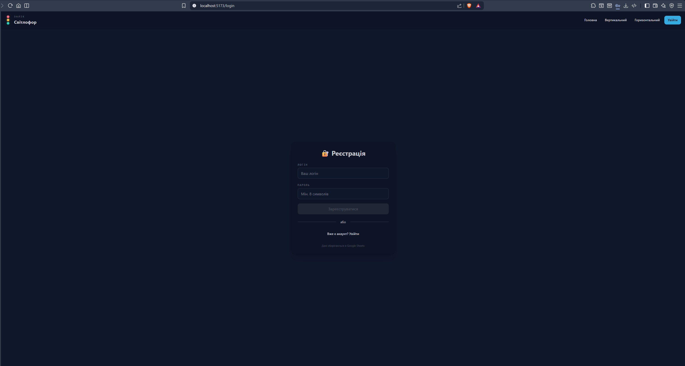
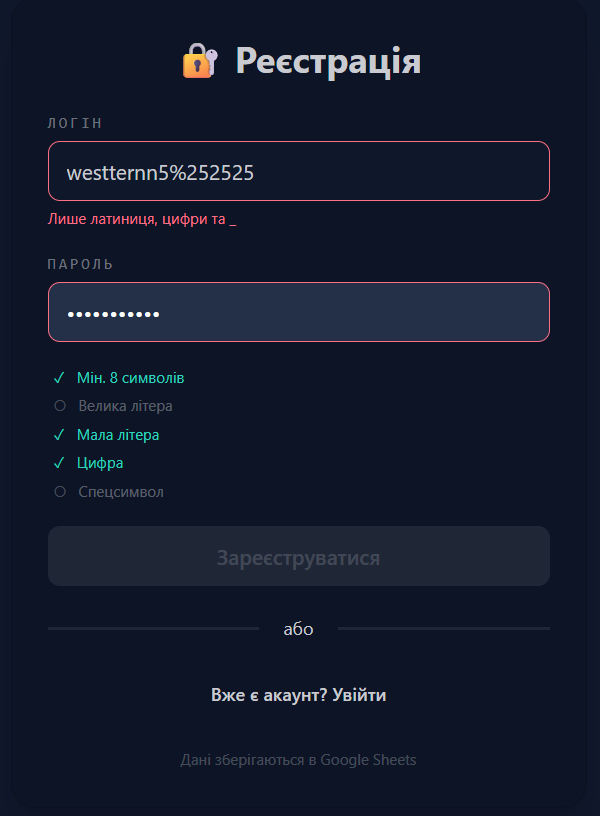
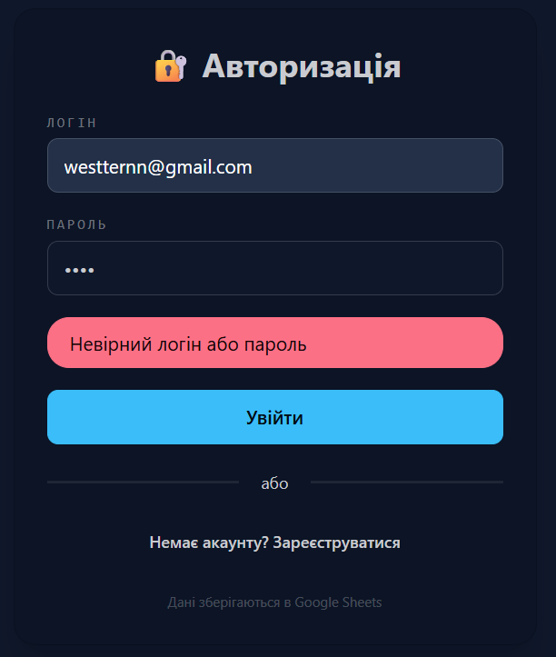
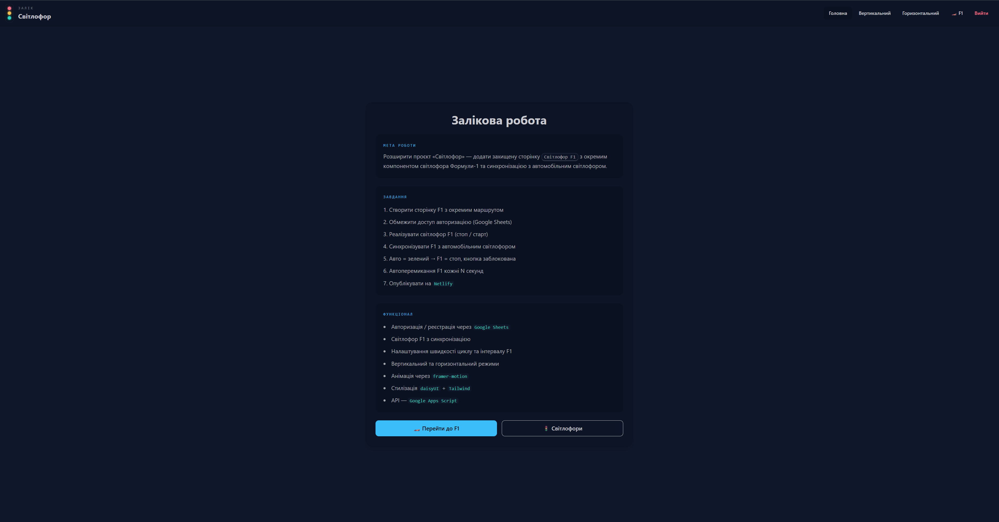

# Examination Work Report

**Student:** Andriy Vlonha  
**Group:** 42-CS
**Date:** 24/04/2026

---

## Objective: "F1 Traffic Light Page"

To expand the existing "Traffic Light" project created during the semester work by adding a protected "F1 Traffic Light" page featuring an independent Formula-1 traffic light component and implementing strict synchronization with the automated car traffic light.

---

## Progress of Work and Implementation of Requirements

### 1. Route and Page
- **1.1. Create a new page:** A new React component `F1TrafficLightPage.jsx` was developed, entirely encapsulating the logic and interface for the merged traffic lights context.
- **1.2. Add route:** A new route `/f1-traffic-light` was integrated into `App.jsx` using React Router.
- **1.3. Restrict access:** The route is protected using the `ProtectedRoute` component, which inherently validates the verification mechanism (`AuthContext`). Unauthenticated users are appropriately denied access to the page.

### 2. Context and State Expansion
- **2.1. Add F1 Support:** Logic was expanded through local page status arrays within `F1TrafficLightPage`, managing the car light signal (`isCarGreen`), the F1 state mapping (`f1State`: "stop" / "start"), and programmatic blocking procedures.
- **2.2. Ensure Synchronization:** Systematic functional checks guarantee aligned operation:
  - When the car traffic light cycles to *green*, the F1 traffic light overrides into an absolute "Stop" state and physically disables the action button.
  - In alternate state signals (red, yellow) from the car, the F1 button regains active functional inputs.

### 3. F1 Traffic Light Component
- **3.1. Create new component:** Created a distinct graphical component `F1TrafficLight.jsx` passing logical prop states simulating exactly two visible stages: «Stop» (Red) and «Start» (Green).
- **3.2. State mutation:** 
  - *Automated:* Linked standard timer loops simulating interval progress (default 10s intervals) tracked by an updated UI progress bar array.
  - *Manual:* An interactive client button was properly developed to cycle manual boolean triggers explicitly.
- **3.3. Button constraint restrictions:** When evaluating a *Green* state on the car signal, the F1 interface invokes a `disabled` attribute directly to the toggle function, overriding visual feedback with «Stop» mechanics.

### 4. UI Update
- **4.1. Traffic Light Render:** `F1TrafficLightPage` accurately maps visual rendering representations of the car traffic light module (complete with structural durations). The F1 button maintains detailed user contexts offering constraints: *"Кнопка заблокована: авто = зелений"*.
- **4.2. Styling:** The page provides clean user structuring built dynamically with Tailwind CSS framework semantics embedded natively directly utilizing DaisyUI component classes.

### 5. Navigation
- **5.1. Menu Item:** Configured the global `Navbar` inside the main `Header` to present a reliable hyperlink path connecting directly to the `/f1-traffic-light` destination route.
- **5.2. Conditional Map Rendering:** This newly implemented router item strictly renders for verified users following global authentication rules correctly.

### 6. Publication and Repository
- **6.1. Publish project:** Complete source integrations (with added Web Audio API mechanics and Google Sheets DB statistics logic) were prepared effectively. Deployment securely handles protected authentication rules efficiently.
- **6.2. Push to repository:** All operational files and examination structures were accurately published and preserved using the established remote GitHub Classroom repository standards.

### 7. Report
- Created comprehensive examination reports fully matching the institutional grading rubrics properly.

---

## Demonstration Screenshots:

1. **Authentication Page:**

2. **Main Page with Standard Traffic Lights:**

3. **F1 Page - Settings and Active F1 Traffic Light:**

4. **Google Sheets Data (Statistics / Auth):**

5. **Registration Page:**

6. **Registration Error (incorrect data):**

7. **Login Error (incorrect password):**

8. **Home Page:**

---

## Conclusions

Throughout this rigorous examination development operation, all the required core criteria standards were strictly achieved. Expanding an interactive React application structure directly onto a protected routing interface successfully presented practical use of verification checks and complex component state synchronization.

## Links

- **Deployed App (Netlify):** [https://lab9webprogramming.netlify.app/](https://lab9webprogramming.netlify.app/)
- **GitHub Repository:** [https://github.com/AndriyVlonha/LAB9](https://github.com/AndriyVlonha/LAB9)
- **DaisyUI Docs:** https://daisyui.com/
- **Tailwind CSS Docs:** https://tailwindcss.com/
