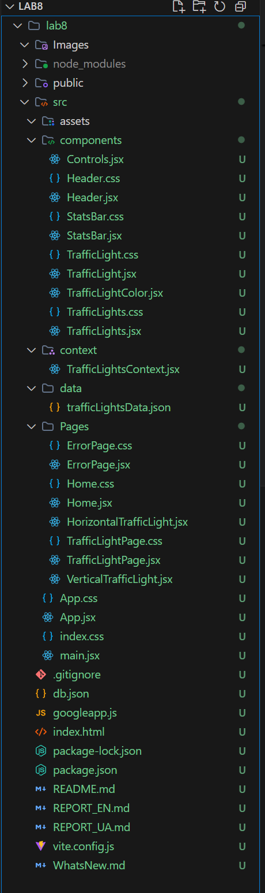
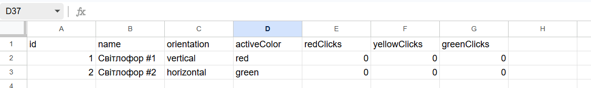
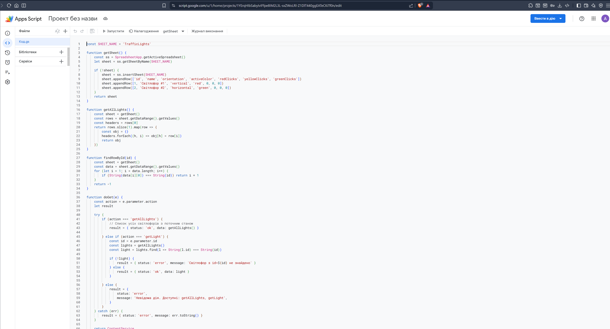
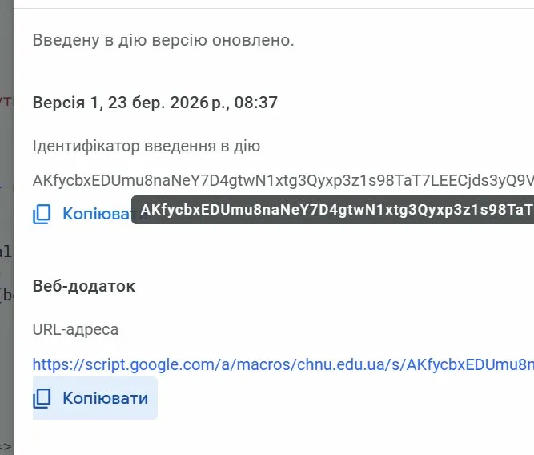
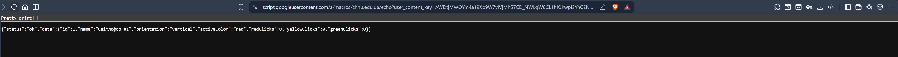
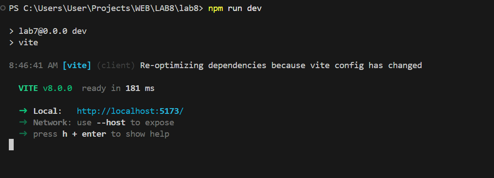

# Звіт з лабораторної роботи №8

**Студент:** Влонга Андрій  
**Група:** 42-КН  
**Дата:** 23/03/2026

---

## Мета роботи

Створити API засобами Google Apps Script. Реалізувати управління станами світлофора та отримання списку всіх світлофорів. Дана робота є продовженням лабораторної роботи №7.

---

## Хід виконання роботи

---

### 1. Створення проєкту на основі Lab 7

```bash
# Скопіювати lab7 як основу
xcopy /E /I LAB7\lab7 LAB8\lab8
cd LAB8\lab8
git init
```

В корені проєкту створено файл `googleapp.js` з кодом API.

---

### 2. Структура проєкту

```
lab8/
├── googleapp.js          ← КОД API (Google Apps Script)
├── README.md
├── db.json
├── src/
│   ├── context/
│   │   └── TrafficLightsContext.jsx
│   ├── components/
│   └── Pages/
```

**Скріншот:**
<div align="center">
  <figure>
    
    <br/>
    <sub><b>Рис. 1:</b> Структура проєкту з файлом googleapp.js</sub>
  </figure>
</div>

---

### 3. База даних — Google Sheets

Дані зберігаються в Google Sheets. Аркуш `TrafficLights` створюється автоматично при першому запуску.

**Структура таблиці:**

| id | name | orientation | activeColor | redClicks | yellowClicks | greenClicks |
|----|------|-------------|-------------|-----------|--------------|-------------|
| 1 | Світлофор #1 | vertical | red | 0 | 0 | 0 |
| 2 | Світлофор #2 | horizontal | green | 0 | 0 | 0 |

**Скріншот:**
<div align="center">
  <figure>
    
    <br/>
    <sub><b>Рис. 2:</b> Google Sheets як база даних</sub>
  </figure>
</div>

---

### 4. Реалізація API (googleapp.js)

**Файл: `googleapp.js`**

#### GET запити — `doGet(e)`

```javascript
function doGet(e) {
  const action = e.parameter.action

  if (action === 'getAllLights') {
    // Повертає список всіх світлофорів
    return jsonResponse({ status: 'ok', data: getAllLights() })

  } else if (action === 'getLight') {
    // Повертає один світлофор по id
    const light = getAllLights().find(l => String(l.id) === e.parameter.id)
    return jsonResponse({ status: 'ok', data: light })
  }
}
```

#### POST запити — `doPost(e)`

```javascript
function doPost(e) {
  const body = JSON.parse(e.postData.contents)

  if (body.action === 'setOrientation') {
    // Змінює орієнтацію: vertical / horizontal
    sheet.getRange(row, 3).setValue(body.orientation)

  } else if (body.action === 'setColor') {
    // Змінює активний колір: red / yellow / green
    sheet.getRange(row, 4).setValue(body.color)

  } else if (body.action === 'addClick') {
    // Збільшує лічильник кліків для кольору
    const current = sheet.getRange(row, col).getValue()
    sheet.getRange(row, col).setValue(current + 1)

  } else if (body.action === 'addLight') {
    // Додає новий світлофор
    sheet.appendRow([newId, name, orientation, 'red', 0, 0, 0])

  } else if (body.action === 'deleteLight') {
    // Видаляє світлофор
    sheet.deleteRow(row)
  }
}
```

**Скріншот:**
<div align="center">
  <figure>
    
    <br/>
    <sub><b>Рис. 3:</b> Код API в редакторі Google Apps Script</sub>
  </figure>
</div>

---

### 5. Деплой API

**Кроки:**
1. Google Sheets → Extensions → Apps Script
2. Вставити вміст `googleapp.js`
3. Deploy → New deployment → Web App
4. Execute as: **Me** | Who has access: **Anyone**
5. Скопіювати URL деплою

**Скріншот:**
<div align="center">
  <figure>
    
    <br/>
    <sub><b>Рис. 4:</b> Деплой Web App в Google Apps Script</sub>
  </figure>
</div>

---

### 6. Тестування API

**GET — список всіх світлофорів:**

```
https://script.google.com/a/macros/chnu.edu.ua/s/AKfycbxEDUmu8naNeY7D4gtwN1xtg3Qyxp3z1s98TaT7LEECjds3yQ9VBukQsKn2x1u7OvOe/exec?action=getAllLights
```

**Відповідь:**
```json
{
  "status": "ok",
  "data": [
    {
      "id": 1,
      "name": "Світлофор #1",
      "orientation": "vertical",
      "activeColor": "red",
      "redClicks": 5,
      "yellowClicks": 3,
      "greenClicks": 7
    }
  ]
}
```

**POST — змінити орієнтацію:**

```json
{ "action": "setOrientation", "id": 1, "orientation": "horizontal" }
```

**POST — змінити активний колір:**

```json
{ "action": "setColor", "id": 1, "color": "green" }
```

**Скріншот:**
<div align="center">
  <figure>
    
    <br/>
    <sub><b>Рис. 5:</b> Тестування API через браузер</sub>
  </figure>
</div>

---

### 7. Запуск проєкту

```bash
npm run start
```

**Скріншот:**
<div align="center">
  <figure>
    
    <br/>
    <sub><b>Рис. 6:</b> Запуск проєкту</sub>
  </figure>
</div>

---

## Результати роботи

### Реалізовані функції:

1. **GET /getAllLights** — список всіх світлофорів з поточним станом
2. **GET /getLight?id=1** — отримати один світлофор
3. **POST setOrientation** — змінити орієнтацію (vertical/horizontal)
4. **POST setColor** — змінити активний колір (red/yellow/green)
5. **POST addClick** — збільшити лічильник кліків
6. **POST addLight** — додати новий світлофор
7. **POST deleteLight** — видалити світлофор

### Технічні деталі:

- **Google Apps Script:** `doGet(e)`, `doPost(e)`, `ContentService`
- **Google Sheets:** `SpreadsheetApp`, `getSheet()`, `appendRow()`, `deleteRow()`
- **REST API:** JSON відповіді з полями `status`, `data`, `message`
- **Валідація:** перевірка допустимих значень orientation та color

---

## Висновки

У ході виконання лабораторної роботи було успішно:
- Створено API засобами Google Apps Script
- Реалізовано GET та POST обробники
- Реалізовано управління станами світлофора (орієнтація, колір)
- Реалізовано список усіх світлофорів з поточним станом
- Задеплоєно Web App та протестовано API
- Google Sheets використовується як база даних

---

## Посилання

- Репозиторій GitHub: [посилання](https://github.com/AndriyVlonha/Lab8_WEB)
- Опублікований API: [посилання](https://script.google.com/a/macros/chnu.edu.ua/s/AKfycbxEDUmu8naNeY7D4gtwN1xtg3Qyxp3z1s98TaT7LEECjds3yQ9VBukQsKn2x1u7OvOe/exec?action=getAllLights)
- Google Apps Script: https://developers.google.com/apps-script
- ContentService: https://developers.google.com/apps-script/reference/content

---